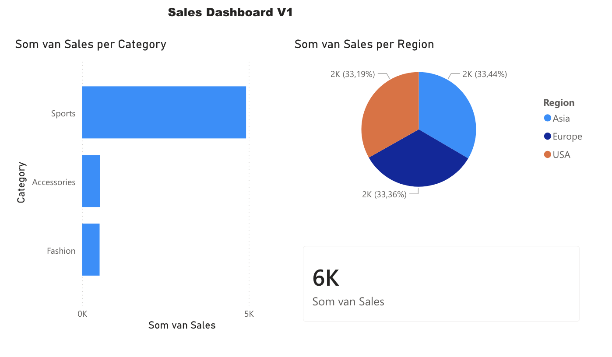

# Sales Dashboard V1

My first Power BI dashboard project built using CSV sales data.

## Dashboard Overview

This report analyzes:

- Sales by Category
- Sales by Region
- Total Sales KPI

## Key Insights

- Sports generated the highest revenue
- Regional sales were evenly distributed
- Total sales reached approximately 6K

## Tools Used

- Power BI
- CSV Dataset
- Data Visualization

## Skills Practiced

- Importing CSV data
- Building charts
- KPI cards
- Dashboard layout
- Business insight reporting

## Dashboard Preview

